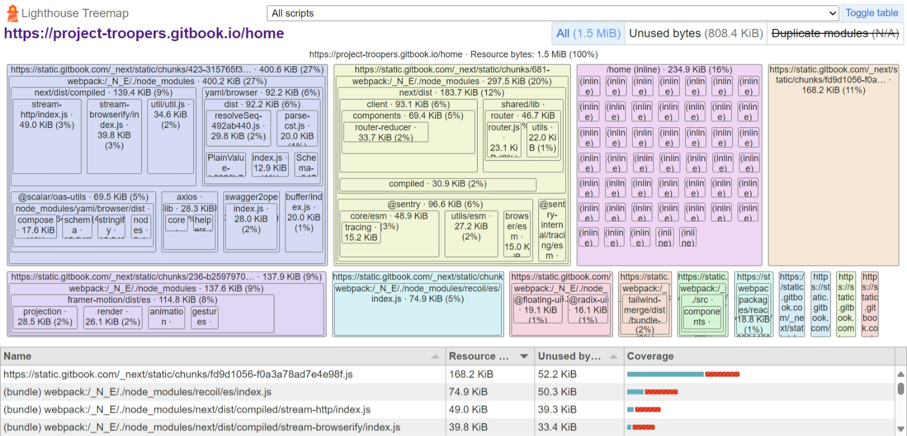

# 📃 Changelog

> <mark style="color:green;">"What happened and how it happened? The thin line between the how and the what, is where the truth lies."</mark> \
> \- Vikrant Khanna (Movie: Runway 34)

## Version 4 (Beta)

* Shifted the hub over to GitBook (and GitHub) and implementing structural changes.
* Loading times have now been improved, the hub loads a lot faster (internet connection dependent)
* Old Hub will be kept online for transparency and redundancy.&#x20;

#### Old Hub - Speed Insights


PageSpeed Insights for the Old Hub


#### New hub - Speed Insights


PageSpeed Insights for the New Hub


<figure><figcaption>
Lighthouse Treemap for the New Hub
</figcaption></figure>

## Version 3.1

* The latest and greatest version of the hub is here!
* The Governing Guidelines are now coming into full force from April 10, 2024 at 7:02 PM IST.
* The Hub’s main page has been restructured for easier loading for the users.
* Internally, each class has been siphoned off from the main document, for better loading times.

## Version 3

* Rolled out on February 24, 2024 at 05:03 PM
* We've restructured the hub's home page for better transparency and easier loading.
* We've restructured the Hub's Craft backend to ensure that the hub loads faster. However, this initiative has broken some older links. So, don't worry if the old links don't work.

## Older Versions

**Version 2.1:-**

* Rolled out on 07/02/2024 at 8:29 AM.
* Added a new Review space section.

**Version 2.0:-**

* Rolled out on 17/01/2024 at 9:48 AM
* Updated the about section (adding ref to Jugzards and the DGA)
* Deploying measures to future-proof the hub.
* Expanded the troopers project, inducted the first and second regiment into Project Troopers… shifted around the announcements and bulletin board page.

**Version 1.2.2:-**

* Rolled out on 08-12-2023 at 6:06 PM
* Updated the core URLs for the web document, the most recent old URLs will still work.

[Troopers Knowledge Hub: Unleash Your Potential](https://troopers.craft.me/)

* Added the Bulletin Board (stable - v1) at The Bulletin Board.

**Version 1.2.1:-**

* Rolled out on 28-11-2023 at 8:12 AM
* Depreciated “OTG” stuff and moved Portion History to Archives.

**Version 1.2:-**

* Rolled out on 22-11-2023
* Reorganized all the announcements into a singular announcements sections (previously Homework List).
* Depreciated the "Psychology" group. The subject will continue to be available on the hub.
* Moved a few "tests" section out of the "On the Group Stuff" into the rebranded "Competitive Exams & Normal Tests" section.
* The Cyber Club was moved from On the Group Stuff to General.

**Version 1.1:-**

* Rolled out on 11-11-2023.
* Bifurcated the HW details from the main documentation for automation purposes.
* Updated the share link, the old one will not work anymore.

[Troopers Knowledge Hub: Unleash Your Potential](http://bit.ly/trooper-hub)

**Stable Release (v1):-**

* Rolled out on 09-10-2023
* Reached operational size.
* Content updates will occur on-the-fly.

**Achieved Platform Stability Version (0.9):-**

* Activated on 07-09-2023
* All APIs, rules would be define by then.
* The Hub reached 80% of operational size.

**Version Alpha (0.1):-**

* Released on 02-08-2023
* Updating all fields and building required structures… There will be no changelog until we reach the Platform Stability Model.

## Trooper Changes

This is the place where we will document all the necessary changes in the Troopers Project.

### 15-01-2024

* The Troopers Project is expanding to include others friends too.
* A restructuring has been initiated.
* Each section or class will constitute or be allegorised as a “Regiment”.
* ⁠If there are separate groups for a subject, it will be called or allegorised as a “Corps” (an army entity that is supposed to provide services).
* ⁠There will be a main “Front” (a group of regiments) group where all members will be allowed to discuss.
* ⁠All groups which have only our friends of one group will be fitted with the moniker “First”.
* ⁠All groups which have only our friends in the second group will be fitted with the moniker “Second”.

### 22-11-2023

1. The speaker is discontinuing (sunsetting) the current "Psychology" group of the Troopers Project because there is already another Psychology group consisting of all Psychology students in Class 11. The speaker wants to respect the independence of this alternate group. However, if the alternate Psychology group wants to join the Troopers project, they are welcome to do so.

> Once again, an invitation is being extended to all individuals who possess materials or have an interest in contributing to the Troopers Hub. It is requested that volunteers actively maintain various sections such as "Psychology", "Computer Science", "Announcements", and "Homework", among others. Contributions ranging from graphic designing, physical drawings, materials, videos, and software-related skills (like API versioning, endpoints, etc) will be highly appreciated. A poll will be posted to gauge interest and availability.

## 05-08-2023

[WhatsApp Audio 2023-08-05 at 21.05.10.waptt](https://res.craft.do/user/full/34ae8ebc-d508-7305-20e2-17e06364862c/doc/3491F8B8-527B-4029-A8C5-FBF1AF7CCE2D/d9694c23-3074-ac37-6909-6e0e7d5f74d6)

After a small problem involving an non-participating party, the description of the Troopers Group was changed to provide more clarity on the function of the group as a whole. The verdict of an admin has been attached above (may contain personal info).

