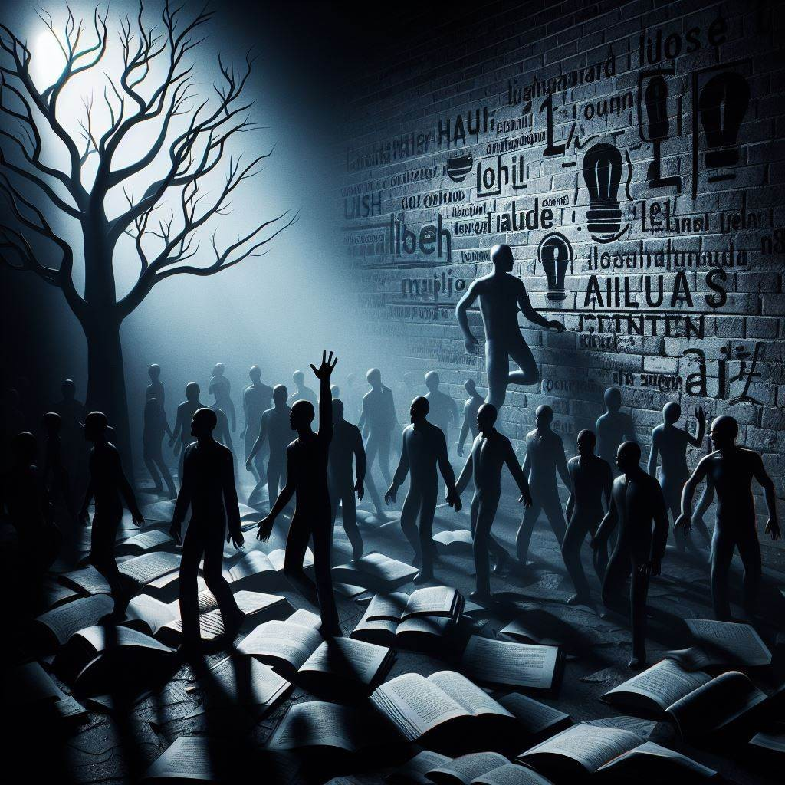
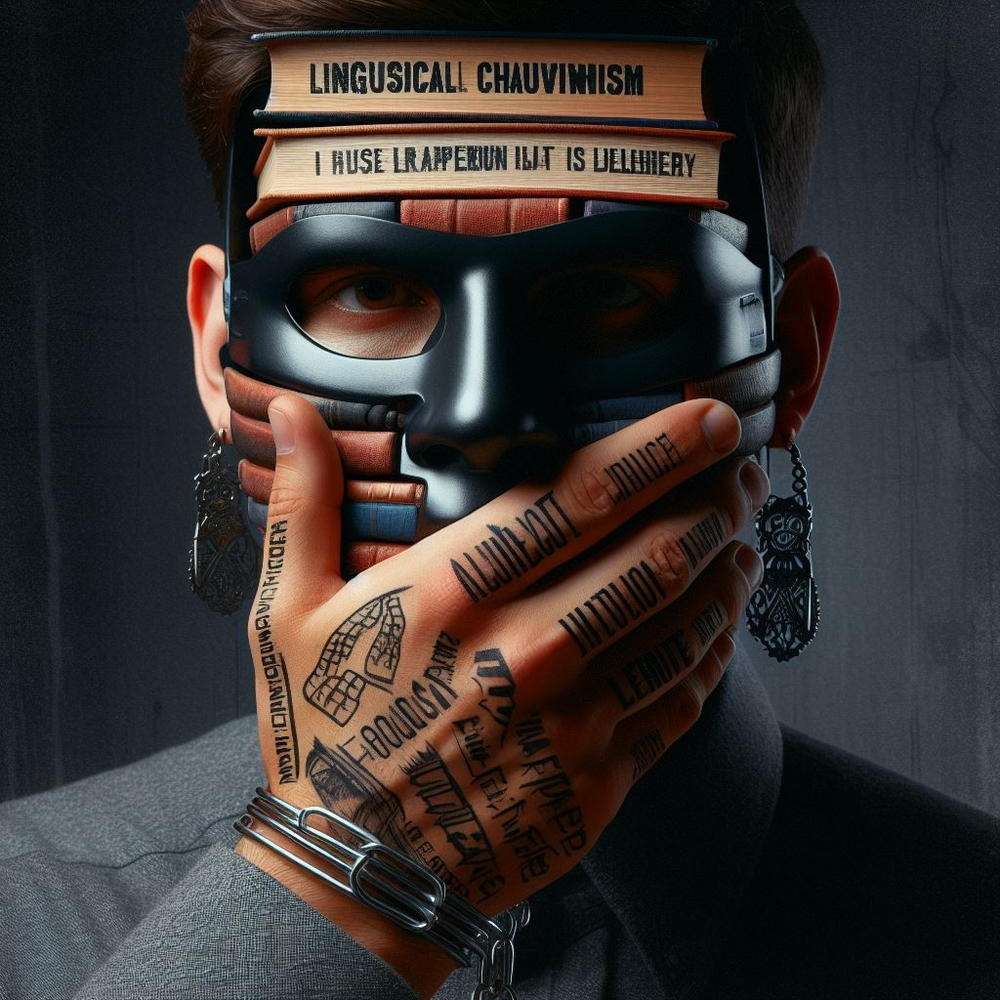
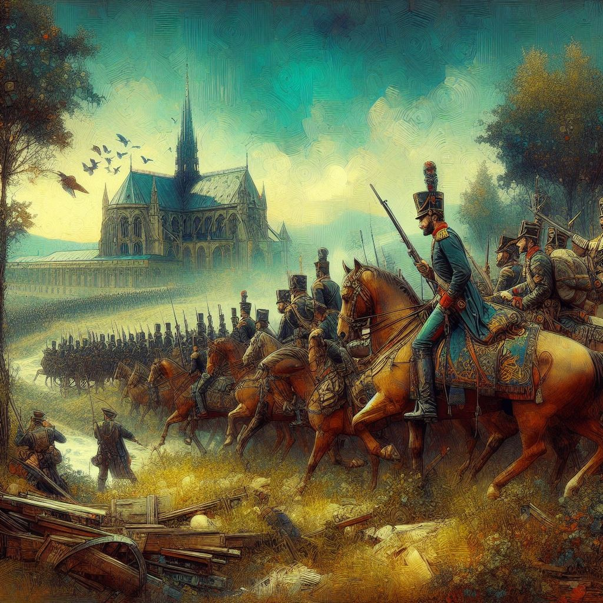
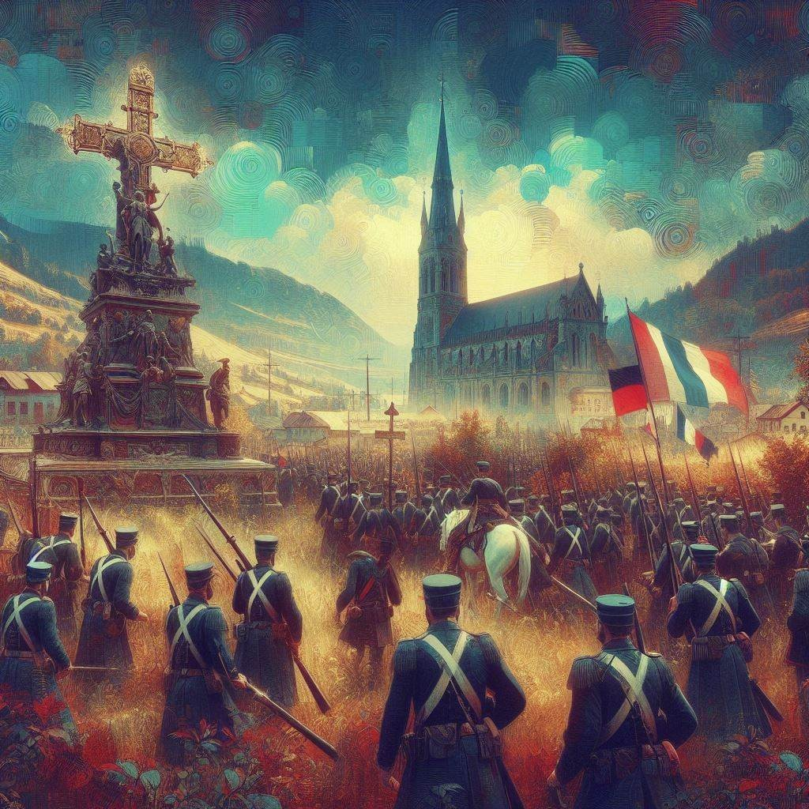

# Ls 1 - The Last Lesson

Vocabulary

1. **primer** _(here)_ - a textbook that is used for teaching children to read.
2. **thunderclap** _(here)_ - a huge shock
3. **reproach** - to express disappointment or disapproval

### Before we enter…

#### What do you think and mean when some utters the word, "Chauvinism"?

<figure><figcaption></figcaption></figure>

 

<figure><figcaption></figcaption></figure>

AI Generated Images (Set 1)

_**AI Generated images.**_ _**Prompt**: Digital Art: Billy Jean King, a woman, defeated Bobby Riggs (US tennis champion, and the self-proclaimed "male chauvinist pig") in a tennis match called "The Battle of Sexes", which helped to popularise feminism in the 1970s._

Well, Chauvinism refers to "excessive or prejudiced support for one's own cause or group". It can also be viewed as a form of "oppression" to the target group The most popular form of Chauvinism is male chauvinism, where a lot of males believed that they were superior. Billy Jean King, a woman, defeated Bobby Riggs (US tennis champion, and the self-proclaimed "male chauvinist pig") in a tennis match called "The Battle of Sexes", which helped to popularise feminism in the 1970s.


Wikipedia - Battle of the Sexes (tennis)


But, have you ever pondered about the concept of Chauvinism based on language? Yes, it does exist, and it’s called **Linguistic Chauvinism**. It is a silent force that perpetuates oppression and discrimination based on language. When individuals are deliberately denied the opportunity to learn a specific language, it is a stark reminder of the insidious nature of Linguistic Chauvinism, casting a dark shadow over a community or society.

<figure><figcaption></figcaption></figure>

 

<figure><figcaption></figcaption></figure>

AI Generated Imagery (Set 2)

**AI Generated images.** **Prompt**: **Linguistic Chauvinism**. It is a silent force that perpetuates oppression and discrimination based on language. When individuals are deliberately denied the opportunity to learn a specific language, it is a stark reminder of the insidious nature of Linguistic Chauvinism, casting a dark shadow over a community or society.

Now, whenever we say that a war has occurred, we talk about its ravages, the destruction that occurred, the loss of lives, and the loss of territory. But, the history books rarely talk about the loss of the way of life for the people who live in the conquered territories. We fail to talk about the effect of war on culture and society as such.

The truth is that we can not relate to such situations, nor do we talk about them. In today’s world, we, the citizens of India, live in a secular country. No one prevents us from practising or proclaiming our own religions, our own thoughts, our own culture and language. We, Indians, are not prohibited from buying land anywhere across the country just because of our place of origin.

Sure, there may be undercurrents, discrimination and dissatisfaction. (e.g remote areas) But, it’s not officially allowed in India. The constitution guarantees and guards our rights. Thus, we and the society are better equipped to battle discrimination.

It’s not just the constitution. The idea of secularism has been etched so much so that Hindi, the language of only 45% of Indians, couldn’t be forced everywhere throughout India. The people revolted and found new ways to win freedom.

In other non-secular countries, however, people are not treated equally on the basis of religion, caste, origin, nationality, culture etc. They are subjugated and pressurised to convert to the official religion, learn the official language and follow the “official” culture of the country. (which is a clear case of majoritarianism)

Back in the days of the Nazis, Adolf Hitler (the then Fuhrér of Germany) enjoyed inventing new ways to punish Jews. Hitler’s pervertism lead to the Holocaust under the guise of the World War 2 and thus, invariably caused the death of millions of people who didn’t choose to be born in that community. They just chanced to be born into the world as Jews.

In a similar way, World War 1 was also fought between the Axis and Allied powers, which started due to the assassination of Archduke Franz Ferdinand, heir to the throne of Austria-Hungary, by Gavrilo Princip in Bosnia… who was just a single person. (A war caused due to the death of one single person? On what grounds is it moral?)

Now, let us focus on the Franco-Prussian War. It was fought between France and Germany, resulting in France’s ultimate defeat. This lead to an armistice between the two nations, where under the new terms, France was forced to give away two territories, Alsace and Lorraine, over to the newly formed German Empire (whose prime minister was Otto Von Bismarck).

<figure><figcaption></figcaption></figure>

 

<figure><figcaption></figcaption></figure>

**AI Generated images.** **Prompt:** Digital Art: Create images related to the Franco-Prussian War, which are safe for use.

It is hard for the people living in a conquered land to continue living peacefully while following their traditions, language and culture. In this case, the Germans forced all the institutions of the conquered territories to use only German. This effectively meant that even schools for kids of all ages had to only teach German and abandon French.

The loss of the Mother tongue is a very devastating issue. It would result in the eventual loss of their identity. In effect, when you prevent a person from practising his/her mother tongue, you are stealing the person of their identity, robbing them of their uniqueness and their freedom.

However, in today’s world, we don’t emphasise on our own languages and culture. We want to mimic, adopt and practice Western traditions and culture. We wish to westernise India. While doing this, we ignore the good ol’ combing styles, the “old rice”, rangoli and other rich traditions that have been secured and passed down from generation to generation.

In this process, there is a loss of uniqueness, a loss of freedom, and a loss of a treasure trove of information that have been concealed in our old traditions and languages. Pretty soon, our language will die out, along with our identity.&#x20;

<figure><figcaption></figcaption></figure>

 

<figure><figcaption></figcaption></figure>

AI Generated Imagery (Set 4)

**AI Generated images.** **Prompt**: Digital Art: Create images of rich Indian culture vs Western culture

If the people abroad, who travel here to see what makes India unique, find that we are simply copying their traditions and culture, what would they think of us? Wouldn’t they look down on us as pathetic? After all, they have preserved their culture well, and remain unique.

Thus, it is imperative that we imbibe the modern elements of society into our age-old traditions and culture, so that we may remember and preserve our roots for a long time to come.

Perhaps this is why language was an important part of our freedom struggle. Literary works were used to convey the ideas and tenets of democracy and free will to the masses who belong to different regions.

How did the news of Gandhi and the Dandi March spread? How were the people informed of mass protests?

It is due to the fact that there were people who carried this information to the remotest of villages and translated them into local tongues. Sometimes, they read books, sang songs and enacted out some drama! This etched the idea of gaining freedom in the hearts of the people, I.e the spark.

#### Let us come back to the lesson now.

This lesson is situated in the region of Alsac, during the aftermath of the Franco-Prussian War we had mentioned earlier. France is a Roman Catholic country. Thus, the church is located at the center of each town, and the important buildings, including the bulletin board, surround it. The important buildings are surrounded by the shops, which are in turn surrounded by the residential areas. The fields flaunt the outskirts of a town, and mark its end.

The village school is part of the important buildings in a town. It is usually a one/two storey building, where the class for all the kids are held in the ground floor, while the teacher who is permanently posted there, lives in the 1st Floor. The entire school consists of only one classroom, and there kids of all ages learn together. They might be put into rows on the basis of age, and each row learns something different.

The students there learn only Maths (Logical , French and Religion. The students in those school learn all their lessons from a single teacher. There are no substitute teachers, so if the teacher has some important work to do, then he has to call the whole school day off.

Since the village school also served as a home for the teacher (and rarely his family), most of the menial work was undertaken by the students (like fetching water etc).

### Vocabulary

1. "quiet as a Sunday morning" - Very quiet & silent
2. Sensory indicators - All the things that we Experience with our senses
3. SAAR - Refers to the river.
4. Linguistic Chauvinism - excessive or prejudiced support for one’s own language.
5. Perception - what you understand about a topic
6. Opinion - what you think about a topic
7. Primer - reader
8. 'mounted" - (here) refers to the fact the teacher was standing on a raised platform.
9. "copies" (context) the sheets from which a student is supposed to copy over specific sentences to practice and improve their handwriting.
10. "fish hooks" - (here) refer to the swivels and lines that younger students try to master before they start writing.
11. the Angelus - a prayer related to the Immaculate Conception of Mary.
12. "the courage to hear every lesson to the very last" - (here) refers the courage it takes to do the job, even during emotion turmoil..

### The Main Overview

> _This section is under development._

* The Last Lesson aims to educate us about the importance of one's language.
* Franz; playful merry boy, usually procrastinates and has very short attention span and is easily distracted.
* The whole lesson revolves around the the use of sensory indicators to create images in the mind of the reader.
* Temptations faced by Franz → warm summer day, birds chirping, drilling of the Prussian soldiers.
* Town hall → bulletin nearby all bad news for two years
* What were things that sparked suspicion in Franz's mind?
  1. Wachter the blacksmith asked Franz not to run since he would be at the school in time.
  2. The school was awfully quiet, there was no hustle / bustle.
  3. The teacher wasn't rude, even though Franz was late.
  4. The teacher was wearing his best Sunday clothes.
  5. The students and the village's were seated quietly and the backbenches were not empty.
* The teacher, M. Hamel', revealed the was the last French lesson the grave truth that this was going to give them.
* M. Hamel was usually a strict taskmaster (taught in the village for 40 years), a patriot to the core. (even wore his best Sunday clothes and took lessons till the very end) and does not consider himself to be perfect.
* The teacher spoke about the beauty of the language and even gave a lesson abt, procrastination (when Franz failed to recite the participles).
* Franz was able to listen and comprehend the lessons clearly, he was unwilling to allow his leave his books. They did some the Angeles. copywriting; some history and prayed
* A swell of emotions occupied M. Hamsel as he wrote "Vive la France" on the board.
* Thus, the last lesson ended

## Assignments

**I.** **Read the given extracts and answer the questions given below:**

1.  Usually when school began, there was a great bustle, which could be heard out in the street, the opening and closing of desks, lessons repeated in unison, very loud, with our hands over our ears to understand better, and the teacher’s great ruler rapping on the table. But now it was all so still I had counted on the commotion to get to my desk without being seen, but of course, that day everything had to be as quiet as Sunday morning. Through the window, I saw my classmates, already in their places, and M.Hamel walking up and down with his terrible iron ruler under his arm. I had to open the door and go in before everybody. You can imagine how I blushed and how frightened I was.

    i. List any two sensory details present in the extract.

    ii. Why does the protagonist feel anxious about entering the classroom on this particular day?

    A. The classmates have started the lesson

    B. The teacher is in a bad mood

    C. The classroom is too quiet

    D. The protagonist is running late

    iii. Complete the sentence appropriately.

    The phrase “as quiet as a Sunday morning” suggests that \_\_\_\_\_\_\_\_\_\_\_\_\_\_\_

    iv. Pick evidence from the extract that helps one infer that this was not the protagonist’s first time being late to school.

    v. What does the term ‘terrible iron ruler’ indicate about M.Hamel?

    vi. Which of the following headlines best suggests the central idea of the extract?

    A. The Fears of a Latecomer

    B. The Importance of Punctuality

    C. The Rigidity of the School System

    D. The Anxiety of a Young Student
2.  Poor man! It was in the honour of this last lesson that he had on his fine Sunday clothes, and now I understood why the old men of the village were sitting there in the back of the room. It was because they were sorry too, that they too had not gone to school more. It was their way of thanking our master for his forty years of faithful service and of showering their respect for the country that was theirs no more. While I was thinking of all this, I heard my name called. It was my turn to recite. What would I not have given to be able to say that dreadful rule for the participle all through, very loud and clear, and without one mistake? But I got mixed up on the first words and stood there, holding on to my desk, my heart beating, and not daring to look up.

    i. List any two details M Hamel discussed in the given extract.

    ii. How did M Hamel react to this show of ‘non-performance’?

    a. He let the iron ruler talk.

    b. He ignored his pupil’s lack of commitment.

    c. He didn’t utter a harsh word in response.

    d. He let Franz be free and sent him out.

    iii. Complete the sentence appropriately.

    The old men of the village on the back benches were\_\_\_\_\_\_\_\_\_\_\_\_\_\_\_

    iv. Pick out an evidence from the extract given that helps one infer his way of showing patriotic love for his land and language.

    v. Who is the “Poor man”?

    vi. Which of the following headlines best suggests the central idea of the given extract?

    a. Honour to the village people

    b. Respect for human beings

    c. Faithful services of M Hamel

    d. Too late for school
3.  Then from one thing to another, M Hamel went on to talk of the French language, saying that it was the most beautiful language in the world- the clearest, the most logical; that we must guard it among us and never forget it, because when a people are enslaved, as long as they hold fast to their language it is as if they had the key to their prison. Then he opened a grammar book and read us our lesson. I was amazed to see how well I understood it. All he said seemed so easy, so easy! I think too, that I had never listened so carefully, and that he had never explained everything with so much patience. It seemed as if the poor man wanted to give us all he knew before going away, and to put it all into our heads at one stroke.

    i. What advice of M Hamel shows that he was a patriot indulging in sentimental exaggeration?

    ii. The line, ‘The French language is the most logical and the most logical language in the world,” can be classified as:

    a. A perception

    b. An opinion

    c. a fact

    d. a theme

    iii. Explain any one possible inference that can be drawn from the line, “M Hamel went on to talk of the French language, saying that it was the most beautiful language in the world; the clearest, the most logical, and we must guard it among us and never forget it”.

    iv. Identify the lines from the given extract which tell us that it is the last time M Hamel was teaching his students French.

    v. Franz, who had been quite slow in learning his own native language, suddenly finds it “so easy”. Which of these options does not corroborate and match the explanation of the given statement?

    a. Franz also realised the value of learning his native language

    b. M Hamel was more patient in explaining the concepts

    c. M Hamel had put all the knowledge into their heads at one stroke

    d. Franz was more attentive and receptive that day

    vi. Complete the sentence with ONE word.

    A language gives a cultural and national \_\_\_\_\_\_\_\_\_\_\_\_ to the people and moulds their perception.

**II.** **Answer in about 40 to 50 words:**

1. What impression does the character of M Hamel leave on you?
2. “We realise the worth of something either before acquiring it or after losing it”. Explain with reference to “The Last Lesson”.
3. What did M Hamel tell his students about the French language? What was his suggestions to them?
4. “Ah how well I remembered it, that last lesson!” Why did Franz remember it well?
5. How were the parents and M Hamel responsible for the children’s neglect of the French language?


**🥇 Created by Troopers 🏆**

The above content has been crafted by experienced troopers in collaboration with AI to generate the accompanying images, and iron out a few kinks in the process. We assure you that the content provided here is distinctive, pushing the boundaries of uniqueness as far as possible.

written and claimed by [The First Brigadier Regiment](craftdocs://open?blockId=2A4304A6-9EAD-4226-A4E1-F5564523F7B1\&spaceId=34ae8ebc-d508-7305-20e2-17e06364862c)on March 26, 2024.

