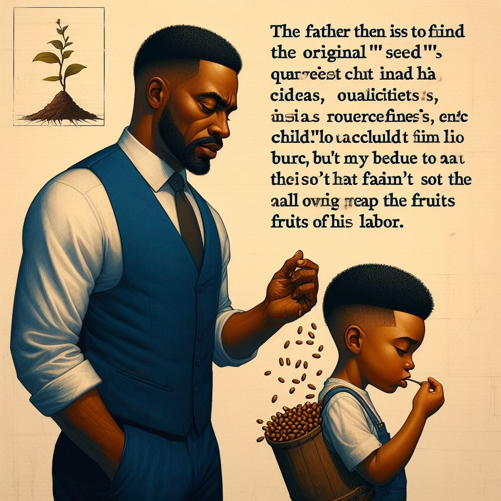

# Governing History

### Second Board Session

_From September 02, 2024 till March 01, 2024 (proposed)_\
_This Board session is officially in session._

Start of the 2nd Board Session

_From September 02, 2024 @ 12:00 AM_

The election results were released in stages; and was finalised on September 01, 2024. New directors were given access to the internal Board of Directors discussion channel and were reminded of their responsibilities.

The new directors have been mentioned below.

* **K.S. Harshavardhan** \
  _representative of the First Brigadier Regiment_
* **Deepan Sai** \
  _representative of the core group that started Project Troopers_
* **B Hari Karthik** (aka **TOPPER**)\
  _representative of the Second Brigadier Regiment_
* **Abdul Hafeez Ali**\
  _representative of the Third and Fourth Brigadier Regiment_
* **Nithin Antonio Dominic**\
  _representative of the Subedars Common Division (Class 11 operations)_
* **Joanna**\
  _representative of the Subedars Common Division (Class 11 operations)_

The liaison from the Election Committee has not changed from the previous session.

### First Interim Period

_From July 07, 2024 to September 01, 2024 (57 days)_

_During this period, the day-to-day operations of the board was carried out by Sugeeth Jayaraj S.A., head of election Committee as defined under Crisis Protocol of the Distribution of Powers Act, 2024. A caretaker Board did exist, consisting of final members of the First Board Session, to decide on crucial matters as and when required._

During this time, the elections were conducted in stages. Since there weren't many participants in the elections, it ran for a prolonged period of 50 days.

### First Board Session

_From 23-02-2024 to July 06, 2024_

This Board Session has officially closed.

End of Tenure of the First Board Session

_July 06, 2024_

The board has been declared as dissolved, except for the purposes of [#proposal-0010](board-history.md#proposal-0010 "mention") and urgent matters regarding immediate supervision; by the Election Committee in light of the next election to the Board.

When the board has dissolved, it means that the directors and CIC(s) also subsequently automatically turn into caretakers as it indicates their end of tenure. The caretaker directors do not have power to enact or propose any new legislation unless it is decided to be absolutely necessary and detrimental to the operations of the project. The caretaker directors can participate in elections, as they are no longer officially directors. The caretaker directors and CICs, however, will lose all of their powers at the moment when the new board swears into office.

Resolution #0010: Approval of the Combined Bills of Passage Legislation

_This resolution is a huge proposal, introduced part-by-part over the course of a week by Sugeeth Jayaraj S.A. (liaison to the Board from the Election Committee). It was subsequently ignored and then reintroduced as a combined proposal._

_**This resolution can also be referred to as "the Combined Bills of Passage" resolution.**_

**Objective:** To complete the initial framework of Project Troopers by introducing legislation on aspects that were not addressed by the Legal Stature.&#x20;

**Bills drafted and introduced (in shorthand form):** The DOPA, The IOFA, The TACRR, and its amendments during the May 31, 2024 to June 7, 2024. Later, the bills were re-introduced as "the Combined Bills of Passage" package. Documents have been attached below.

#### The Summary of the proposal has been given below:-

1. **Arbitration Committee Rules and Regulations, 2024 (TACRR 2024)**

* Purpose: Establishes the Project Troopers Arbitration Committee (PTAC) to resolve disputes and enforce policies3
* Composition: Consists of 5 to 9 members with specific eligibility and appointment criteria.
* Procedures: Outlines the process for case submission, review, hearings, and decisions.

2. **Distribution of Powers Bill, 2024 (DOPA 2024)**

* Power Distribution: Details the separation of powers within Project Troopers.
* CIC Role: Defines the Collaborator In-Charge’s responsibilities and limitations.
* JPR Bodies: Describes the autonomy and accountability of the JPR bodies (ArbCom, Election Committee, Board). Creation of the Office of IT, Office of Legal Consult
* Unified Impeachment Protocol: To impeach a person in power if they violate their posts and duties.
* Protection of Acts: Introduces a general scheme for protecting all acts under different classifications.
* Crisis Protocol: If any of the most important bodies of the project are not functioning, due procedures to follow.
* Small other rules have also been mentioned, read the document for the full details.

3. **Incorporation of Foreign Assets Bill, 2024 (IoFA 2024)**

* Asset Incorporation: Governs the acquisition of foreign assets by Project Troopers.
* Dealing Protocol: Establishes procedures for negotiating and finalizing asset deals.
* Naturalization Protocol: Details the process for integrating new assets into Project Troopers.

**Vote results: 1-nil-3-1-nil**\
_Vote results are in the for-against-neutral-abstained-reclused format._\
_**Timeframe**:_ From May 31, 2024 to 19/07/2024 at 2:00 PM.

**Approvers**: Nithin\
**Detractors**: _None_\
**Neutral:** K.S. Harshavardhan, Deepan, Faheema\
**Abstained**: Eric\
**Reclused**: _None_

**Note:** The TACRR was introduced as a part of this proposal as the body has not become functional as of that date. The Board is using its provisional powers to enact binding legislation on the Arbitration Committee until it is able to conduct an official internal vote on the matter.

**The Final Version of the package, with amendments and t**he other draft proposals have been attached below:-









Consensus Discussion #0009

_May 30, 2024_

**Objective**: To discuss about the TECRR legislation put forward by the Election Committee due to moral limitations. The TECCR was put up in the board forum for consensus review as the election committee was down to one member, and thus felt that it was unable to make proper unbiased decisions.

_"This was performed as a friendly gesture and should not be taken as the precedent for future actions."_ - Sugeeth Jayaraj S.A., the first head of the Election Committee

_Requested by the head of the election committee Sugeeth Jayaraj. The exact request has been posted below:_

_"Hello board, I'm initiating a new consensus for your consideration, as the Election Committee is down to one member and thus it would not be democratic if I approve my own bill. Hope you guys would be kind enough to review this bill."_

**Consensus formulated:** The consensus was that there were no objections brought against the bill.

**Consequence: The TECRR** was brought into effect by the Head of the Election Committee Sugeeth Jayaraj S.A.

Consensus Discussion #0008

_May 04, 2024_

**Objective**: To discuss about the feasibility and the structural changes needed to assign people to take care of particular regiments and divisions of Project Troopers.

_Raised by Co-CIC Deepan Sai._

**Consensus formulated (as put forth by Deepan Sai, abridged here for better understanding):-**

1. There will be a head of each regiment elected by the directors.
2. People in the regiment will take turns each week to send homework and test details.&#x20;
3. Everyone can express their opinion to the head of the regiment if they feel a need for change.&#x20;
4. Groups other than the First Brigadier Regiment will be under heavy supervision or will be removed from the hub.

_There were no objections to the above concensus._

<mark style="color:orange;">Proposal #0007 (Dangerous and Archived)</mark>

_April 29, 2024_

_This is a proposal that aims to change the basic essence of the Legal stature. It will follow the voting procedures enshrined in the legal stature (Version 1)._

_Raised by Co-CIC Deepan Sai._

Laws shall be reframed and simplified involving no legal actions or requirements- law shall only guide the members of the group.

This vote was not able to continue due to it being ignored by the Board. Some votes were cast, but they were not enough to exceed the required threshold. This proposal has been archived.

**Vote results: 2-nil-nil-3-nil**\
_Vote results are in the for-against-neutral-abstained-reclused format._\
_**Timeframe**: No Timeframe was agreed upon or put forth by the co-CICs._

**Approvers**: K.S. Harshavardhan, Deepan, \
**Detractors**: _None_\
**Neutral:** _None_\
**Abstained**: Nithin, Faheema, Eric\
**Reclused**: _None_

Resolution #0006: Changes to the Election Committee and Board responsibilities

_April 28, 2024_

A resolution was passed that includes the following points:

* To allow a member from the election committee to stay as a liaison between the board and election committee. This will invariably mean that they will have to be part of this group, but they won't be a director. They would somewhat close to an advisor, who can request or initiate proposal in the group, but can't vote on them.
* To extend the timeframe to conduct the election for the next replacement director and put the responsibility of conducting the election on the election committee instead of Sugeeth, the caretaker CIC (as his caretaker period will end today night at 11:59 PM)
* To give the election committee the power to appoint any member of Project Troopers to itself (and invariably make them as administrators).
* To allow the election committee head to have admin access to all the groups and works of Project Troopers.
* To give each director a responsibility to maintain over a particular section of the Project Trooper operations on decisions that does not need Board approval, pertaining to that particular section. (Eg: Class 12 operations, Hub educational operations, Legal operations etc)
* To define the option of 'recluse' as (I) automatic, when the involvement of a director in voting is controversial or is about a case which is about them or if they are an outgoing director (II) manual, as decided by the board
* To initiate an internal consensus (discussion) about the feasibility of giving the directors a particular tenure to serve in, and to put forth laws that would allow only 1/3rd of the board members' tenure to expire at any given point in time, with reasonable exceptions.

**Vote results: 3-1-0-1-1**\
_Vote results are in the for-against-neutral-abstained-reclused format._\
_**Timeframe**: By April 28, 2024 at 6:00 PM, as one of the points in this proposal need immediate attention... which was extended for one more day._

**Approvers**: K.S. Harshavardhan, Deepan, Faheema\
**Detractors**: Eric\
**Neutral:** _None_\
**Abstained**: Nithin\
**Reclused**: Sugeeth (since he was only a caretaker director)

Resolution #0005: Grant of Adminship and full access to all groups for the CICs

_April 23, 2024._

A resolution to grant a request made by the upcoming CIC "K.S. Harshavardhan". The resolution was to allow the CIC(s) to have administrator access to all regiments and groups of Project Troopers. It was passed, with the following results.

**Vote results: 2-0-1-3-1**\
_Vote results are in the for-against-neutral-abstained-reclused format._\
_**Time Frame**: From 23-04-2024 05:21 PM to 24-04-2024 06:21 PM (25 hours -> new, extended from original timeframe due to low vote count)_

**Approvers**: K.S. Harshavardhan, Deepan\
**Detractors**: _None_\
**Neutral:** Nithin\
**Abstained**: Eric, Faheema\
**Reclused**: Sugeeth (since he was only a caretaker director)

Resolution #0004: Selection of the new CIC

_April 22, 2024._

A resolution to officialise the result of an internal election to choose a new CIC(s) to lead the board after Sugeeth completely stepped down on April 28, 2024 was passed. The elected candidates also accepted to be the Collaborators-In-Charge of Project Troopers.

**Vote results: 5-0-0-1**\
_Vote results are in the candidate 1 - candidate 2 - abstained - reclused format._\
_**Time Frame**: From 22-04-2024 05:08 PM to the end of the same day_

**Voted for Deepan and Harshavardhan as Co-Candidate(s) ID 1** : Deepan, Nithin, Harshavardhan, Faheema, Eric\
**Voted for Eric (Candidate ID 2): \_None**\_

**Detractors**: _None_\
_A_**bstained:** _None_\
**Reclused**: Sugeeth (since he was only a caretaker director)

Resignation of <a data-mention href="https://app.gitbook.com/u/9Om3tUS42vUVpNcq3eN15t09EZU2">Sugeeth Jayaraj S.A.</a> from the Board (Case ID: #0003)

* **Resignation**: Sugeeth Jayaraj stepped down from his roles as a director and as CIC of Project Troopers, on April 19, 2024.
* **Gratitude and Ongoing Membership**: Sugeeth thanked everyone for their teamwork and looked forward to staying on with Project Troopers.
* **Importance of Integrity**: He stressed keeping the project honest and urged the completion of official rules.
* **Administrative Duties**: Even after resigning, Sugeeth will manage the digital assets of Project Troopers as an admin, whose main aim is to do ownership operations under the oversight of the board.
* **Temporary Leadership**: He will act as a temporary/caretaker CIC and director until 28th April, 2024; after which any newly elected CIC(s) would take charge.

Attached the resignation file below.

/



Consensus #0002: Proposal for Expanding Computer Corps Program Summary

A student, recommended by a friend of Aakash, has expressed interest in joining the exclusive Computer Corps. The current structure limits participation to students from our school.

#### Considerations

1. **Inclusivity vs. Exclusivity**: Balancing the program's exclusiveness with potential benefits of inclusivity.
2. **Resource Allocation**: Assessing if expansion could strain resources or diminish the quality of the program.
3. **Precedent Setting**: Deciding whether this case sets a precedent for future admissions from outside the current internal setup.

#### Recommendations

1. **Expand Internally**: Allow the interested student to join the current Computer Corps, evaluating the impact on the group dynamics and resources.
2. **Create a New Group**: Alternatively, establish a separate computer group for external participants, maintaining the exclusiveness of the original Corps but fostering outreach and inclusivity.

#### Decision Requested

The Board of Directors was kindly asked to deliberate on the mentioned recommendations and make a decision regarding the most suitable approach for the inclusion of the student and potential future external candidates.

#### Discussion

1. **Eric**: Suggested that the person may join the existing group and remaining silent.
2. **Deepan**: Advocated for a separate group, highlighting:
   1. Irrelevance of class-related updates for some members
   2. The possibility of sharing targeted resources
   3. Easier access to study materials for all
   4. Enhanced privacy
3. **Harshavardhan**: Supported the creation a separate group to maintain privacy and relevance for school members.

**Formulated Consensus**: Allow them to participate in the computer science division as a new group.

Resolution #0001: Legalisation of Governing Guidelines

A resolution to bring the original governing guidelines along with the Legal Stature into force was passed by the board.

**Vote results: 2-1-3**\
_Vote results are in the for-against-abstained format._\
_**Time Frame**: From 08-04-2024 06:15 PM to 09-04-2024 06:15 PM (24 hours)_

**Approvers**: [Sugeeth Jayaraj S.A.](https://app.gitbook.com/u/9Om3tUS42vUVpNcq3eN15t09EZU2 "mention"), Nithin\
**Detractors**: K.S. Harshavardhan\
**Abstained**: Eric, Deepan, Faheema

Appointment of Arbitrary Directors

The first set of directors were appointed to the board over the course of 2 months. The appointed directors were Sugeeth Jayaraj S.A. (virtue as creator and then-head of the Project), Nithin, K.S. Harshavardhan, Eric, Deepan, Faheema.

Creation of the Board

The board was created by a general vote held among the members of Project Troopers. It came into existence on 23-02-2024.

This page is a legacy of Project Troopers and its operations within its top-most control body, The Troopers Board of Directors.

### Before the Board of Directors

The decisions were taken with general consensus of all members in Project Troopers.

January 15, 2024

* The Troopers Project is expanding to include others friends too. Accordingly, a restructuring has been initiated.
* Each section or class will constitute or be allegorised as a “Regiment”.
* ⁠If there are separate groups for a subject, it will be called or allegorised as a “Corps” (an army entity that is supposed to provide services).
* ⁠There will be a main “Front/Division” (a group of regiments) group where all members will be allowed to discuss.
* ⁠All groups which have only our friends of one group will be fitted with the moniker “First”.
* ⁠All groups which have only our friends in the second group will be fitted with the moniker “Second”.

November 22, 2023

The speaker is discontinuing (sunsetting) the current "Psychology" group of the Troopers Project because there is already another Psychology group consisting of all Psychology students in Class 11. The speaker wants to respect the independence of this alternate group. However, if the alternate Psychology group wants to join the Troopers project, they are welcome to do so.

Once again, an invitation is being extended to all individuals who possess materials or have an interest in contributing to the Troopers Hub. It is requested that volunteers actively maintain various sections such as "Psychology", "Computer Science", "Announcements", and "Homework", among others. Contributions ranging from graphic designing, physical drawings, materials, videos, and software-related skills (like API versioning, endpoints, etc) will be highly appreciated. A poll was posted to gauge interest and availability.

August 5, 2023

[WhatsApp Audio 2023-08-05 at 21.05.10.waptt](https://res.craft.do/user/full/34ae8ebc-d508-7305-20e2-17e06364862c/doc/3491F8B8-527B-4029-A8C5-FBF1AF7CCE2D/d9694c23-3074-ac37-6909-6e0e7d5f74d6)

After a small problem involving an non-participating party, the description of the Troopers Group was changed to provide more clarity on the function of the group as a whole. The verdict of an admin has been attached above (may contain personal info).

This is the old description of the WhatsApp Doubt Group.

The new description has been given below.

